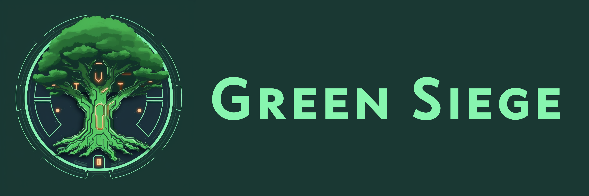

Green-Siege est un jeu de tir en réalité virtuelle palpitant, se déroulant dans le cadre sidéral. Votre mission ? Protéger un arbre géant et sacré contre les attaques d'ennemis implacables déterminés à le détruire. Cette création est née de notre participation au concours [Games on Web 2023](https://www.cgi.com/france/fr-fr/event/games-on-web-2023), orchestré par [CGI France](https://www.cgi.com/france/fr-fr/).

Pour expérimenter Green-Siege, visitez le site officiel du jeu : [https://greensiege.miacloud.org/](https://greensiege.miacloud.org/). Pour une immersion totale, il est recommandé d'utiliser un casque de réalité virtuelle (le jeu a été développé et testé avec le [Meta Quest 2](https://www.meta.com/fr/en/quest/products/quest-2/)).

- Lien du jeu : https://greensiege.miacloud.org/
- [Documentation](./DOCUMENTATION.md)
- [Photos du développement](https://photos.app.goo.gl/UehrKyVD4UDjgxXX9)
- [Vidéo de GamePlay](https://youtu.be/cvqwD1WY90I)
- [Git Original](https://github.com/Brotherta/green-siege)

## Le Concept du Jeu

Dans [Green-Siege](https://greensiege.miacloud.org/), vous serez plongé au cœur d'un univers spatial sur une île flottante abritant un arbre antique et majestueux. En tant que protecteur intrépide, votre mission est de défendre ce joyau contre des vagues incessantes d'ennemis déterminés à le détruire. Avec 6 niveaux de difficulté croissante, vous devrez faire preuve de dextérité et d'endurance pour affronter des adversaires toujours plus redoutables. Le jeu propose également un tutoriel détaillé, vous permettant de découvrir étape par étape les mécaniques de jeu.

## Gameplay

Immergez-vous dans une expérience de réalité virtuelle intense où habileté et réflexes rapides sont essentiels pour venir à bout de vos ennemis. Muni d'un pistolet laser d'une main et d'un bouclier de l'autre, vous affronterez des vagues d'ennemis robotiques, tentant de vous vaincre à travers des attaques coordonnées. Votre objectif : les éliminer tous sans périr.

Lorsqu'un projectile ennemi approche dangereusement, le temps se ralentit, vous donnant l'opportunité d'esquiver la menace en utilisant les mouvements de votre corps. Gérez adroitement votre bouclier - à durée de vie limitée et nécessitant un temps de régénération. Utilisez-le stratégiquement pour bloquer les offensives ennemies, mais veillez à ne pas l'épuiser totalement. Attention également à ne pas surchauffer votre pistolet laser en tirant trop rapidement, car il nécessite une courte période de refroidissement.

Développez une stratégie efficace, faites preuve de précision et d'une gestion habile de vos ressources pour survivre aux vagues d'ennemis et protéger l'arbre sacré. Immergez-vous dans cette aventure remplie d'action où votre dextérité et votre détermination seront mises à l'épreuve pour préserver le dernier bastion de vie dans le cosmos.

## Comment Jouer

Pour profiter pleinement de l'expérience immersive de Green-Siege, assurez-vous d'avoir un casque de réalité virtuelle compatible, comme le Meta Quest 2.

### Comment Jouer en Ligne

1. Connectez votre casque de réalité virtuelle à votre réseau Wi-Fi.
  
2. Visitez le site du jeu à l'adresse : [https://greensiege.miacloud.org/](https://greensiege.miacloud.org/).
  
3. Lorsque vous êtes prêt, activez le mode réalité virtuelle en cliquant sur l'icône appropriée, généralement située en bas à droite de l'écran.
  
4. Vous serez immédiatement plongé dans l'univers virtuel de Green-Siege. Utilisez les contrôles de votre casque VR pour interagir avec le jeu et défendre l'arbre sacré.

### Comment Compiler et Jouer en Local

1. Clonez le projet en utilisant la commande : `git clone https://github.com/gamesonweb/be-green-green-siege.git`.
  
2. Accédez au répertoire du projet avec la commande : `cd be-green-green-siege`.
  
3. Installez les dépendances en exécutant la commande : `npm install`.
  
4. Générez les certificats nécessaires avec la commande : `openssl req -newkey rsa:2048 -new -nodes -x509 -days 3650 -keyout key.pem -out cert.pem`.
  
5. Assurez-vous que votre casque de réalité virtuelle est connecté au même réseau Wi-Fi que l'ordinateur sur lequel le serveur tourne.
  
6. Lancez le serveur en mode réalité virtuelle avec la commande : `npm run vr`.
  
7. Ouvrez le navigateur de votre casque VR et entrez l'adresse IP de l'ordinateur sur lequel le serveur tourne, suivi du port 8080 (par exemple, `http://192.168.1.100:8080`).
  
8. Le jeu Green-Siege se chargera dans votre casque de réalité virtuelle. Utilisez les contrôles de votre casque VR pour interagir avec le jeu et préserver l'arbre sacré.
  
## Crédits

Green-Siege a été développé par Rémi Cérès, Rémi Felin et Antoine Vidal dans le cadre du concours Games on Web 2023. Nous tenons à exprimer notre gratitude à CGI France, Michel Buffa, David Catuhe et Sébastien Vandenbergue pour avoir organisé ce concours stimulant, offrant l'opportunité de mettre en valeur nos compétences et notre créativité.

Pour en savoir plus sur les développeurs :

- Rémi Cérès: [GitHub](https://github.com/remiceres), [LinkedIn](https://www.linkedin.com/in/remiceres/)
- Rémi Felin: [GitHub](https://github.com/RemiFELIN), [LinkedIn](https://www.linkedin.com/in/r%C3%A9mi-felin-b100b8173/)
- Antoine Vidal: [GitHub](https://github.com/Brotherta), [LinkedIn](https://www.linkedin.com/in/antoine-vidal-mazuy)